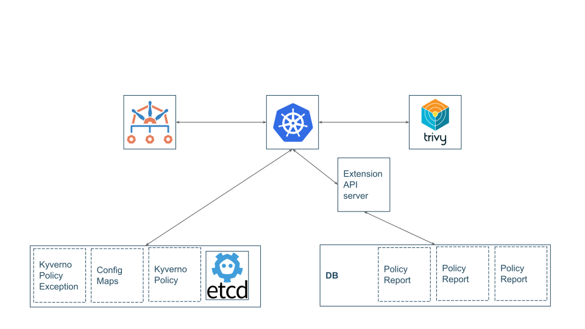

## Introduction

Policy Reports are used by Kyverno to store the result of policies and cluster policies that match a resource. Kyverno generates reports during admission request as well as periodically as background scans. They are very helpful in auditing the current state of policy compliance in a cluster.

Kyverno also creates its own custom ephemeral reports which are later aggregated to create the final policy reports or cluster policy reports. Policy reports and ephemeral reports are stored in etcd as Custom Resources. 

This setup works fine in most cases, but in larger-scale environments the limits of the Kubernetes API server could be reached. During periods of especially heavy reporting, the volume of data being written to and read from etcd can put the API server under severe load which can lead to degraded performance. Additionally, etcd has a maximum capacity limit and therefore has a limited number of resources it may store. This limit can be reached in large clusters with many report producers.

Today, we are excited to announce [reports-server](https://github.com/kyverno/reports-server), a new Kyverno project which aims to improve scalability of reporting in large clusters giving you all the benefits of visibility without compromising on performance.

In this blog post we will introduce reports server, discuss its architecture, and provide steps on how to get started.

## Architecture

The reports-server solves the problem of scalability of policy reports by storing policy reports outside of etcd in a relational database. This has the following advantages:

1. Alleviation of the etcd + API server load and capacity limitations.
2. Common report consumer workflows can be more efficient.
3. With reports stored in a relational database, report consumers could instead query the underlying database directly, using more robust query syntax.

The reports-server achieves this by using [Kubernetes API aggregation layer](https://kubernetes.io/docs/concepts/extend-kubernetes/api-extension/apiserver-aggregation/), where it creates an API service that takes all the request from the local api server and processes them in the reports-server. The reports-server has access to a relational database which it uses to store and query for policy reports and ephemeral reports.

A high-level overview of the architecture is shown below.


## Performance

The reports-server stores policy reports and ephemeral reports outside etcd this reducing the database size of etcd. In the following tables we shows the database size of etcd of increased workloads with and without reports server. In this test, we installed Kyverno policies to audit the Kubernetes pod security standards using 17 policies. Subsequently, we created workloads (pods, deployments, replicasets) that match the installed Kyverno policies and scheduled them on the fake KWOK nodes to measure total size of policy reports in etcd. [KWOK](https://kwok.sigs.k8s.io/) is a toolkit that enables setting up a cluster of thousands of Nodes in seconds. `DB_SIZE` in the output of `etcdctl endpoint status -w table` was used to calculate etcd DB size. For more details on these tests, refer to the testing documentation for [the report controller](https://github.com/kyverno/kyverno/tree/main/docs/perf-testing). Kyverno version used for this testing was `v1.12.1`. 

### Without reports-server

| # policyreports | total etcd size |
| --------------- | --------------- |
| 1270            | 134 MB          |
| 2470            | 223 MB          |
| 3770            | 280 MB          |
| 4970            | 334 MB          |
| 7370            | 467 MB          |
| 9770            | 552 MB          |
| 10010           | 552 MB          |

### With reports-server

| # policyreports | total etcd size |
| --------------- | --------------- |
| 1204            | 71 MB           |
| 2404            | 115 MB          |
| 3604            | 152 MB          |
| 4804            | 191 MB          |
| 7204            | 276 MB          |
| 9604            | 343 MB          |
| 10250           | 370 MB          |

As shown in the benchmark, the size of etcd grows with increase in the number of resources in the cluster but the growth is slower when reports-server is installed. As reports-server stores policy reports in a seperate database, they don't take up any space in etcd. At 10k reports, database size of etcd is 33% smaller when reports-server is installed.

## Getting Started

To start using the reports-server, you have to install it in your cluster, and after some moments, all the reports related requests will be redirected for etcd to the reports server database.. Reports-server has multiple methods for installation: YAML manifest and Helm Chart. Detailed instructions for all installation methods can be found in the [installation guide](https://github.com/kyverno/reports-server/blob/main/docs/INSTALL.md).

To install reports server using YAML manifest, run the following commands:
Create a namespace for reports-server:
```bash
kubectl create ns reports-server
```
Apply the reports-server manifest:
```bash
kubectl apply -f https://raw.githubusercontent.com/kyverno/reports-server/main/config/install.yaml
```

This install manifest will install the following things
1. A deployment and service for the reports server
2. A postgres instance
3. An API service to redirect requests to the reports-server

Reports-server comes with a postgreSQL database but you can have finer control of the database configation by bringing your own database. See the [database configuration guide](https://github.com/kyverno/reports-server/blob/main/docs/DBCONFIG.md).

### Migration

If you already have policy reports CRD installed in your cluster, you will have an existing API service managed by kube-aggregator that sends requests to the kubernetes API server. You will have to update the existing API service to send request to reports-server. See the [migration guide](https://github.com/kyverno/reports-server/blob/main/docs/MIGRATION.md).

## Conclusion

In this short blog post we demonstrated how reports server can be used to store policy reports.

The reports-server is a new project from Kyverno that can be helpful for users with a large cluster with a huge reporting activity. This project is maintained by Kyverno and will have future updates and features based on feedback.

🔗 Check out the project on GitHub: https://github.com/kyverno/reports-server

